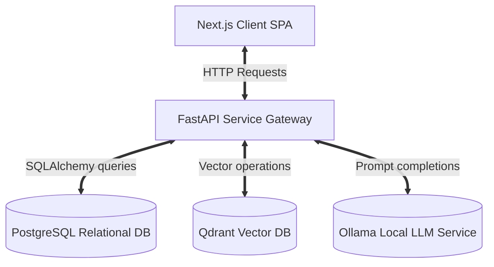

# AI Resource Management Decision Intelligence Platform

This platform optimizes human resource allocations, project assignments, and capacity forecasts across a technical services organization.

---

## 1. Project Overview
The AI Resource Management Platform is a decision intelligence client-server application. It processes organizational timesheets, skillsets, competencies, and sales pipeline deals to make resource planning and project assignments fully backend-driven.

## 2. Business Problem
- **High Bench Overhead**: Inability to rotate resources off project assignments quickly when timelines complete.
- **Suboptimal Resourcing**: Matching candidates manually without robust verification of skills, competencies, or availability.
- **Capacity Forecasting Blindness**: Hard to predict team supply/demand ratios over a six-month window.

## 3. Proposed Solution
An integrated decision intelligence architecture combining:
- A hybrid candidate matching search (PostgreSQL filtering + Qdrant similarity search).
- An active project health monitor assessing delivery status risks.
- A rolling capacity planning scenario simulator.

## 4. Key Features
- **Semantic Resource Spotlight**: Search engine querying employee vector profiles.
- **Fit Explanations**: Generative RAG reports explaining why a resource fits a project.
- **Embeddings Sync Triggers**: Vector indexing reload directly from the dashboard.
- **What-If Forecast Scenarios**: Simulate sales pipeline impacts.

## 5. Technology Stack
- **Backend Core**: FastAPI (Python), SQLAlchemy (ORM).
- **Frontend Core**: Next.js 15 (App Router, Turbopack), React 19, TypeScript, Tailwind CSS, Shadcn UI, TanStack Query (v5), Framer Motion, Recharts.
- **Databases**: PostgreSQL 16 (Relational), Qdrant (Vector DB).
- **LLM/AI Orchestrator**: Local Ollama running `qwen2.5:7b` (or Groq/Gemini APIs).

## 6. High-Level Architecture


## 7. Repository Structure
See `docs/12_Repository_Structure.md` for a comprehensive breakdown of all modules.

## 8. Dataset Description
Dataset CSV tables are loaded from `datasets/raw/` containing:
- `employees.csv`: HR payroll rosters.
- `skills.csv`: Catalog of skill details and experience metrics.
- `competencies.csv`: Professional consulting scorecards.
- `projects.csv`: Project metadata and active statuses.
- `allocations.csv`: Assignment histories.
- `pipeline.csv`: Anticipated CRM pipeline deals.

## 9. Data Cleaning Pipeline
Managed via `scripts/cleaning/clean_data.py`:
- Parses and standardizes date values.
- Filters duplicates and resolves null keys.
- Outputs clean files to `datasets/processed/` and seeds PostgreSQL.

## 10. Database Architecture
Relational tables schema implemented in `backend/database/models.py`:
- `employees`: Core details (employee_id, location, job, department).
- `projects`: Key timelines, status, and project managers.
- `allocations`: Assigns employee IDs to project IDs with allocation ratios.
- `skills`: Skills catalog.
- `competencies`: Hires consultancy scores.

## 11. Vector Database
Qdrant is populated using the `generate_embeddings.py` script:
- Collections: `employees`, `projects`, `pipeline`.
- Model: `SentenceTransformer("all-MiniLM-L6-v2")` (384-dimensions, COSINE).

## 12. Recommendation Architecture
- **Retriever**: Queries Postgres for active staff and Qdrant for semantic compatibility scores.
- **Scoring**: Blends Skills (40%), Competencies (30%), Availability (20%), and Historical Similarity (10%).
- **Explanation**: Context is passed to Ollama to generate professional fit reports.

## 13. Project Health Engine
- **Schedule**: Flags red alerts if delay days > 14 days.
- **Utilization**: Identifies overallocated (>100%) or benched (<70%) resources.
- **Billability**: Compares billable hours to shadow costs.

## 14. Forecast Engine
- Combines Postgres active allocations with CRM pipeline deals to estimate future supply/demand gaps over a six-month rolling projection.

## 15. AI Copilot
- Intent Classifier handles requests for Recommendations, Health summaries, or Forecasts, enriching prompts with database contexts and returning conversational answers.

## 16. RAG Pipeline
- Retrieves vector contexts from Qdrant, merges them with PostgreSQL relational metadata, and formats prompts for local LLM generation.

## 17. API Architecture
Exposes FastAPI routes under `/api/*` for health status checks, searches, recommendations, and forecasts. Detailed specs in `docs/10_API_Documentation.md`.

## 18. Frontend Architecture
- Client Components (`"use client"`) using React Query hooks for client caching and state binding.
- Recharts maps charts; Framer Motion manages dialog drawers.

## 19. Docker Architecture
Bridge networking (`resource-network`) links `resource-postgres`, `resource-qdrant`, `resource-ollama`, `resource-backend`, and `resource-frontend`.

## 20. Folder Structure
Organized under:
- `backend/`: Router and engines.
- `frontend/`: App pages and services client.
- `docs/`: Numbered documentation files.

## 21. Installation
Follow instructions inside `docs/13_Developer_Guide.md` to set up virtual environments and Node modules.

## 22. Environment Variables
- `NEXT_PUBLIC_API_URL=http://localhost:8000` (browser API gateway URL).
- `DATABASE_URL=postgresql://postgres:postgres@db:5432/postgres` (internal Docker DB URL).

## 23. Running with Docker
```bash
docker-compose up --build -d
```

## 24. Running without Docker
- Run backend locally on port `8000`.
- Run frontend using `npm run dev` on port `3000`.

## 25. Data Pipeline
Execute raw CSV clean and load:
```bash
python scripts/cleaning/clean_data.py
```

## 26. Embedding Pipeline
Trigger profile synchronization:
```bash
python -m backend.embeddings.generate_embeddings
```

## 27. Testing
Validate API routes:
- Run backend checks: `pytest`
- Run frontend builds: `npm run build`

## 28. Troubleshooting
Detailed remedies for database locks, LLM timeouts, and CORS errors are listed in `docs/14_Troubleshooting.md`.
