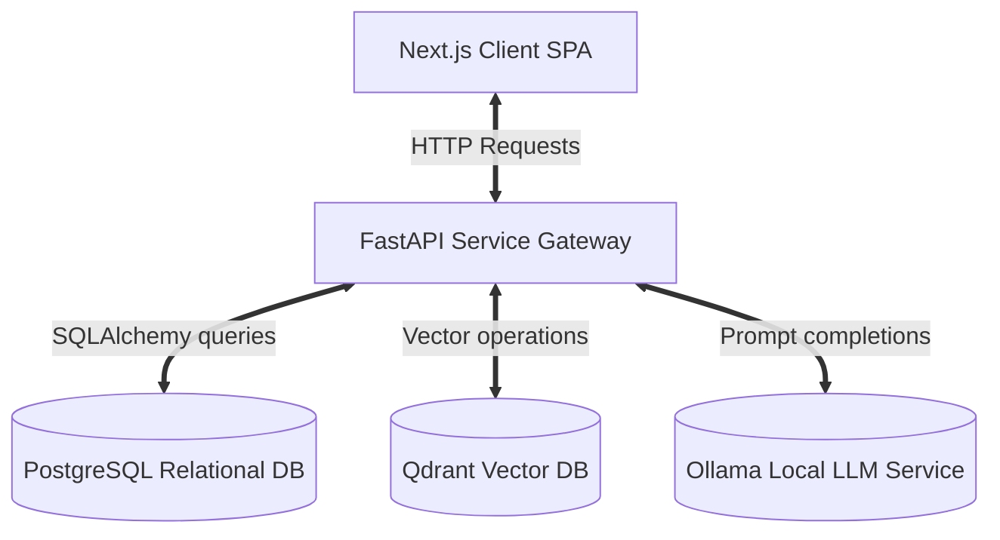
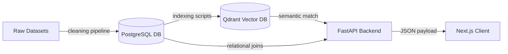
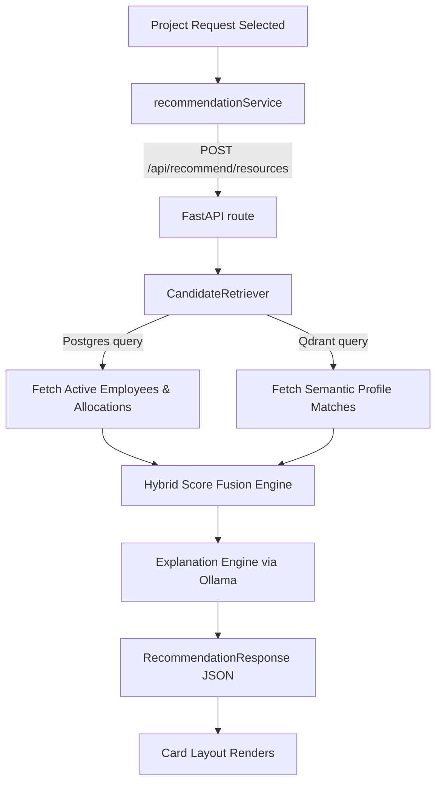
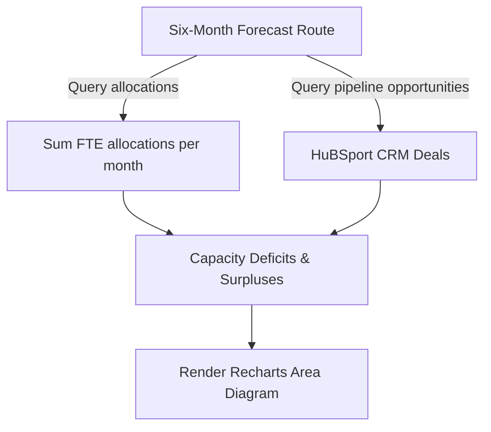
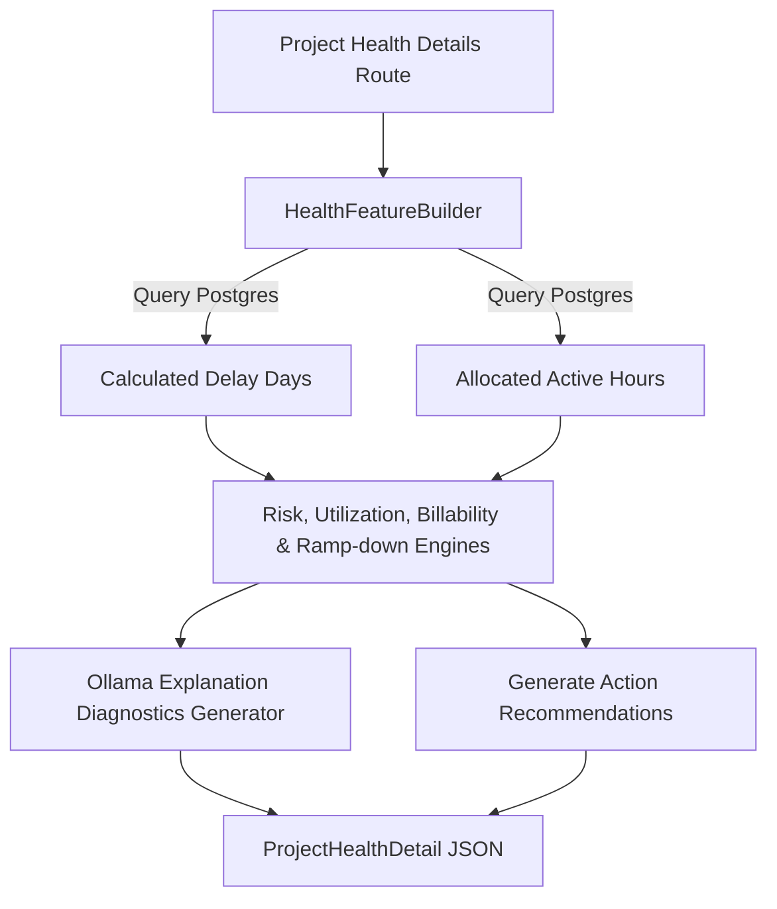
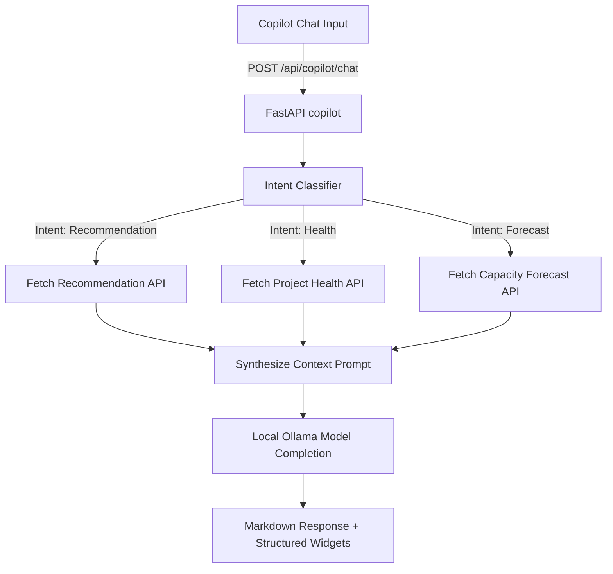
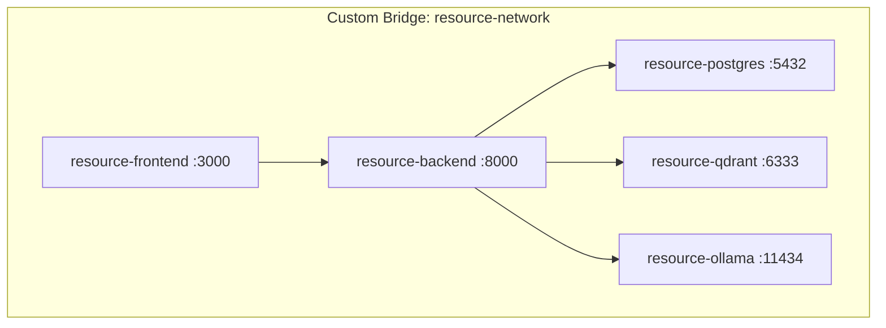
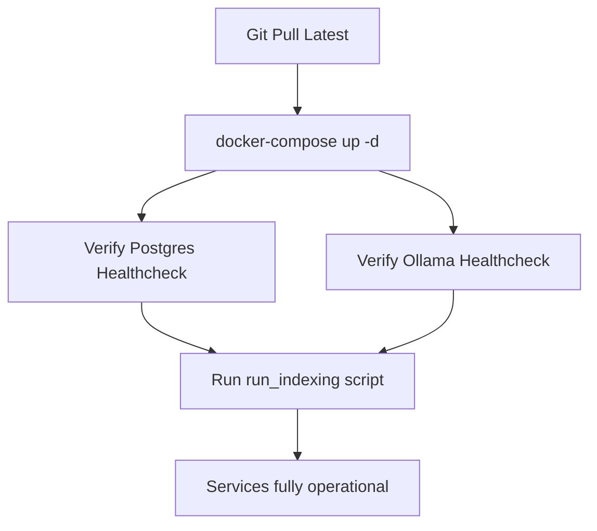

# System Architecture

This document describes the high-level system architecture, components, and data paths of the platform.

---

## 1. Overall Architecture Diagram

---

## 2. Data Flow Diagram

---

## 3. Recommendation Pipeline

---

## 4. Forecast Pipeline

---

## 5. Project Health Pipeline

---

## 6. Copilot Pipeline

---

## 7. Docker Architecture

---

## 8. Deployment Flow

