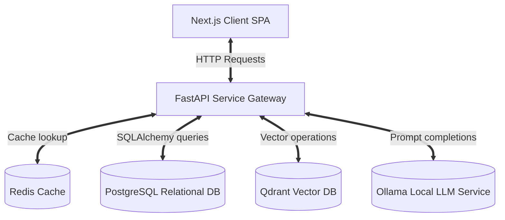
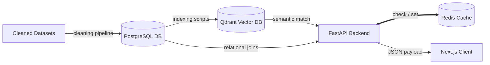
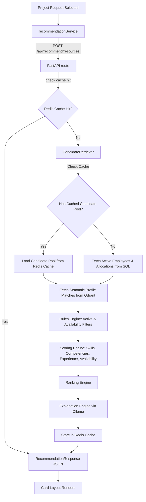
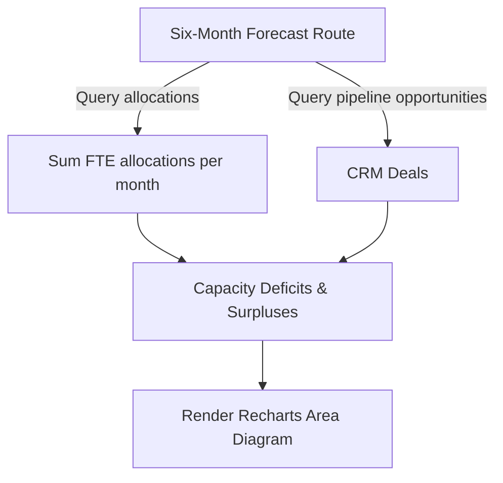
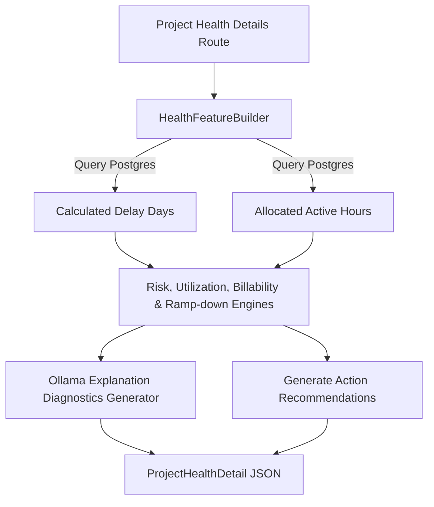
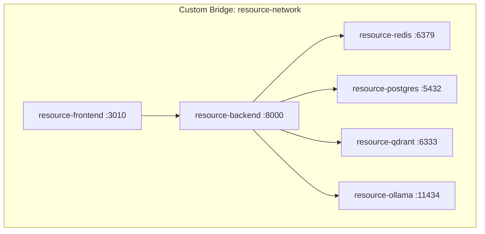
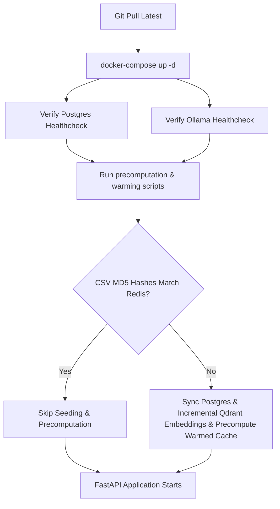

# 02. System Architecture

This document describes the high-level system architecture, components, and data paths of the platform.

## 1. Overall Architecture Diagram

## 2. Data Flow Diagram

## 3. Recommendation Pipeline

## 4. Forecast Pipeline

## 5. Project Health Pipeline

## 6. Docker Architecture

## 7. Deployment & Startup Flow

## 8. Offline Precomputation & Caching System
To minimize recommendation latency and relational database overhead:
- **Offline Profile Precomputation**: On startup, structured active employee profiles, allocations, project names, and skill frequencies are compiled into serialized cache pools (`precomputed:candidate_pool` and `precomputed:projects_name_map`).
- **Warm Redis Cache**: The server pre-populates dashboard summary views, forecasting results, and active pipeline recommendation response objects under their respective Redis keys before serving any external user requests.
- **Incremental Updates Check**: The startup orchestrator compares local CSV file MD5 checksums with cached values. Embedding rebuilds and Postgres loads are triggered only for the specific modified datasets, saving processing resources.
