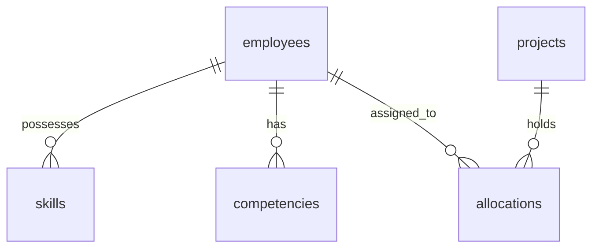

# 04. Database Design

This document details the relational database schema implemented in `backend/database/models.py`.

## 1. Table Definitions

### `employees`
- `employee_id` (VARCHAR, PK): Unique payroll identifier (e.g. `EMP10`).
- `location` (VARCHAR): Operating office location.
- `job_name` (VARCHAR): Staff designation/title.
- `department_name` (VARCHAR): Assigned business department.
- `is_active` (INTEGER): Active status (1 for active, 0 for resigned).
- `resignation_date` (DATE): Planned departure date.

### `projects`
- `project_id` (INTEGER, PK): Primary key.
- `client_id` (VARCHAR): Target client name.
- `type_of_project` (VARCHAR): Engagement type (e.g. Consulting, Delivery).
- `project_start_date` (DATE): Timeline start date.
- `project_end_date` (DATE): Target end date.
- `project_manager` (VARCHAR): Assigned project manager.
- `project_status` (VARCHAR): Project state (e.g. Active, Completed).

### `allocations`
- `id` (INTEGER, PK): Auto-increment primary key.
- `employee_id` (VARCHAR, FK): References `employees.employee_id`.
- `project_id` (INTEGER, FK): References `projects.project_id`.
- `allocation_by_percentage` (DOUBLE PRECISION): Allocation workload ratio (FTE percentage).
- `allocated_start_date` (DATE): Assignment start date.
- `allocated_end_date` (DATE): Assignment end date.
- `is_allocation_active` (INTEGER): Active status (1 for active, 0 for inactive).

### `skills`
- `id` (INTEGER, PK): Auto-increment primary key.
- `employee_id` (VARCHAR, FK): References `employees.employee_id`.
- `skill` (VARCHAR): Skill name.
- `score` (DOUBLE PRECISION): Capability rating (0.0 to 5.0).
- `experience_numeric` (DOUBLE PRECISION): Professional experience in years.

### `competencies`
- `employee_id` (VARCHAR, PK, FK): References `employees.employee_id`.
- `stakeholder_management_score` (DOUBLE PRECISION): Level rating.
- `consultative_guidance_score` (DOUBLE PRECISION): Level rating.
- `techno_functional_score` (DOUBLE PRECISION): Level rating.
- `communication_score` (DOUBLE PRECISION): Level rating.
- `ambiguity_navigation_score` (DOUBLE PRECISION): Level rating.
- `capabilities_articulation_score` (DOUBLE PRECISION): Level rating.
- `solution_architecture_score` (DOUBLE PRECISION): Level rating.
- `project_planning_score` (DOUBLE PRECISION): Level rating.

### `pipeline`
- `id` (INTEGER, PK): Unique pipeline deal primary key.
- `client_name` (VARCHAR): Potential client.
- `required_role` (VARCHAR): Targeted team role.
- `skillset` (VARCHAR): Required skills list.
- `likely_start_date` (DATE): Target project start date.
- `probability` (DOUBLE PRECISION): Close ratio.
- `expected_fte` (DOUBLE PRECISION): Expected resource FTE count.
