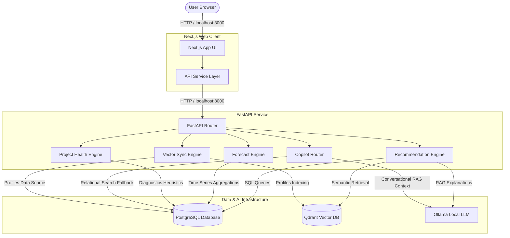

# High-Level System Architecture

The AI Resource Management Platform is structured around a decoupled microservice architecture. It combines relational storage, semantic vector indexing, and generative language model orchestration to support intelligent staffing allocations, capacity planning, and project health diagnostics.

---

## 1. Architecture Block Diagram

The following diagram illustrates the interactions between the client browser, API orchestrator, data layers, and the local AI services.

---

## 2. Core Components

### A. Next.js Frontend
- **Framework**: Next.js (Pages and Routing).
- **Styling**: Tailwind CSS v4 and Framer Motion for responsive design and micro-animations.
- **State Management**: TanStack React Query for async caching and synchronization with the backend API layer.
- **Services**: Grouped under `src/services/` (dashboard, recommendation, forecast, health, copilot, search, reports). Every page communicates with the centralized API layer via the `fetchAPI` client, ensuring no mock API states are preserved.

### B. FastAPI Backend
- **Framework**: FastAPI (Python 3.11).
- **ORM**: SQLAlchemy connecting to PostgreSQL.
- **Microservices & Decision Engines**:
  - **Recommendation Service**: Employs a hybrid candidate-matching logic that combines SQL skill filters with Qdrant vector-similarity calculations. Evaluates availability and historical performance to rank candidates.
  - **Forecast Service**: Aggregates HubSpot deal pipelines and active project resource allocations to forecast headcount, role deficits, and hiring demand over a rolling 6-month period.
  - **Project Health Service**: Computes heuristic risk scores using weekly status reports, timesheet hours, and billing rates to identify delayed delivery timelines or resource burnout.
  - **Copilot Service**: Conversational router utilizing Ollama to classify user queries, fetch relevant diagnostic contexts from databases, and compile executive markdown responses.

### C. Relational Data Layer (PostgreSQL)
- Stores core entities (Employees, Projects, Allocations, Timesheets, Skills, Competencies, Pipeline opportunities).
- Serves as the primary source of truth for time tracking, contract logs, and allocations.

### D. Vector Data Layer (Qdrant)
- Hosts indexed embeddings of Employee AI Profiles, Project delivery history, and Pipeline deal specifications.
- Enables semantic similarity matching for natural-language skill queries.

### E. LLM Provider Layer (Ollama)
- Hosts local models (such as `qwen2.5:7b` or `nomic-ai/nomic-embed-text-v1.5`) for text generation and reasoning.
- Executes prompts inside RAG pipelines to create staffing explanations and answer copilot queries.
