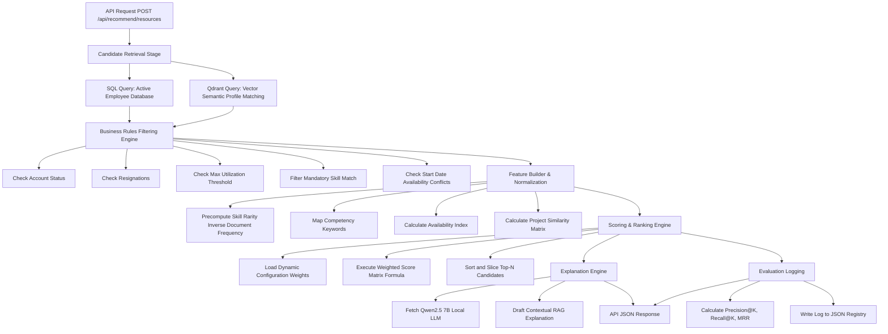

# AI Recommendation Engine Framework

This document outlines the architecture, mathematical scoring formulas, business logic filters, configurations, and API structures for the **AI Recommendation Engine**. 

---

## 1. System Architecture

The recommendation engine operates as a hybrid, multi-stage pipeline:



---

## 2. Mathematical Scoring Model

The final score $S_c$ for a candidate employee $c$ is a weighted sum of five key matching parameters:

$$S_c = w_{\text{skill}} \cdot F_{\text{skill}}(c) + w_{\text{competency}} \cdot F_{\text{competency}}(c) + w_{\text{experience}} \cdot F_{\text{experience}}(c) + w_{\text{availability}} \cdot F_{\text{availability}}(c) + w_{\text{similarity}} \cdot F_{\text{similarity}}(c)$$

### Weight Constraints
All configuration weights are loaded dynamically and normalized to sum to exactly $1.0$:

$$\sum w_i = w_{\text{skill}} + w_{\text{competency}} + w_{\text{experience}} + w_{\text{availability}} + w_{\text{similarity}} = 1.0$$

### Parameter Explanations & Formulas

#### A. Skill Match Score ($F_{\text{skill}}$)
Combines simple match percentage with **Skill Rarity Weights** (computed using Inverse Document Frequency principles over the employee base):
- **Skill Rarity (IDF)**:
  $$\text{IDF}(s) = \ln\left(1 + \frac{N}{1 + n_s}\right)$$
  Where $N$ is the total count of active employees and $n_s$ is the number of active employees possessing skill $s$.
- **Formula**:
  $$F_{\text{skill}}(c) = 100 \cdot \frac{\sum_{s \in M_c} \text{IDF}(s)}{\sum_{s \in R} \text{IDF}(s)}$$
  Where $R$ is the list of required skills and $M_c$ is the set of required skills possessed by candidate $c$.

#### B. Competency Match Score ($F_{\text{competency}}$)
Evaluates matching required soft/hard competency pillars (e.g., "Stakeholder Management", "Communication Skills"):
$$F_{\text{competency}}(c) = 100 \cdot \frac{\sum_{cp \in C_c} \text{Score}(cp)}{\text{MaxScore} \cdot |R_{\text{comp}}|}$$
Where $R_{\text{comp}}$ is the list of requested competency categories, $C_c$ is the set of matching competencies of candidate $c$, and $\text{Score}(cp)$ is the numeric rating (e.g. 1.0 to 4.0).

#### C. Project Experience Score ($F_{\text{experience}}$)
Balances tenure with completed successful project allocations:
$$F_{\text{experience}}(c) = 100 \cdot \left( 0.5 \cdot \min\left(1.0, \frac{\text{Years}(c)}{\text{MaxYears}}\right) + 0.5 \cdot \min\left(1.0, \frac{\text{ProjectCount}(c)}{\text{MaxProjects}}\right) \right)$$
- Default parameters: $\text{MaxYears} = 15.0$, $\text{MaxProjects} = 10.0$ (configurable in `config.yaml`).

#### D. Availability Index ($F_{\text{availability}}$)
Quantifies employee bandwidth availability:
$$F_{\text{availability}}(c) = 100 - \text{Utilization}(c)$$
- Candidates exceeding the configuration threshold (e.g. $90\%$) are immediately filtered out.

#### E. Project Similarity Score ($F_{\text{similarity}}$)
Measures historical experience similarity based on cosine similarities from the Qdrant semantic index:
$$F_{\text{similarity}}(c) = 100 \cdot \text{CosineSimilarity}(v_{\text{req}}, v_c)$$

---

## 3. Dynamic Configuration (`config.yaml`)

The entire engine's logic is driven by a configuration file, allowing non-code modifications to immediately take effect:

```yaml
# config.yaml
weights:
  skill_match: 0.40          # 40% priority
  competency_match: 0.20     # 20% priority
  project_experience: 0.15   # 15% priority
  availability: 0.15         # 15% priority
  project_similarity: 0.10   # 10% priority

filters:
  max_utilization_threshold: 90.0   # Discard candidates above this
  require_mandatory_skills: true    # Reject if they miss requested skills
  min_similarity_threshold: 0.30    # Minimum vector similarity boundary

normalization:
  max_experience_years: 15.0
  max_projects_completed: 10.0

llm:
  enable_explanations: true
  temperature: 0.2
  max_tokens: 400
```

---

## 4. API Endpoints

### POST `/api/recommend/resources`

Returns a sorted list of the best-matching resource recommendations, complete with structured score breakdowns and RAG-driven natural language justification.

#### Request Schema (JSON)
```json
{
  "project_id": "CLIENT_101_005",
  "required_skills": ["Python", "SQL"],
  "project_type": "AI",
  "required_competencies": ["Communication Skills", "Stakeholder Management"],
  "project_start_date": "2026-08-01",
  "top_n": 3
}
```

#### Response Schema (JSON)
```json
{
  "recommendations": [
    {
      "employee_id": "EMP11",
      "job_name": "Senior Software Engineer",
      "department_name": "Delivery",
      "final_score": 62.85,
      "rank": 1,
      "category_scores": {
        "skill_match": 79.0,
        "competency_match": 80.0,
        "project_experience": 1.67,
        "availability": 100.0,
        "project_similarity": 0.0
      },
      "availability_date": "Immediate",
      "utilization_percentage": 0.0,
      "matching_skills": ["Python"]
    }
  ],
  "explanation": "### Recommendation Summary\nCandidate EMP11 is recommended as the prime match for this project, exhibiting solid Python programming alignment and immediate capacity.\n\n### Why Recommended:\n- Full capacity (0% current utilization) with immediate availability.\n- Matches key programming requirements with 79/100 skill weight.\n\n### Potential Risks:\n- Requires database verification for specific SQL coverage since EMP11 has self-declared Excel and PySpark focus.\n\n### Recommendation Confidence:\nHigh.",
  "processing_time_ms": 10542.12,
  "model_version": "v1"
}
```

---

## 5. Offline Evaluation Framework

An integrated validator reports recommendation precision, recall, and search relevance metrics to detect model drifts:

1. **Precision@K**: Measures percentage of recommended resources who have successfully worked on similar projects in historical logs.
2. **Recall@K**: Measures the proportion of overall successful historical team resources identified in the Top-K recommendations.
3. **Mean Reciprocal Rank (MRR)**: Measures how early the first correct historical candidate appears in the ranked output.

All metrics are appended dynamically to `backend/recommendation/eval_registry.jsonl`.
