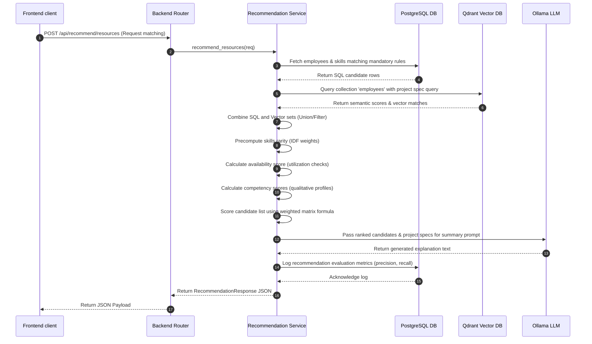
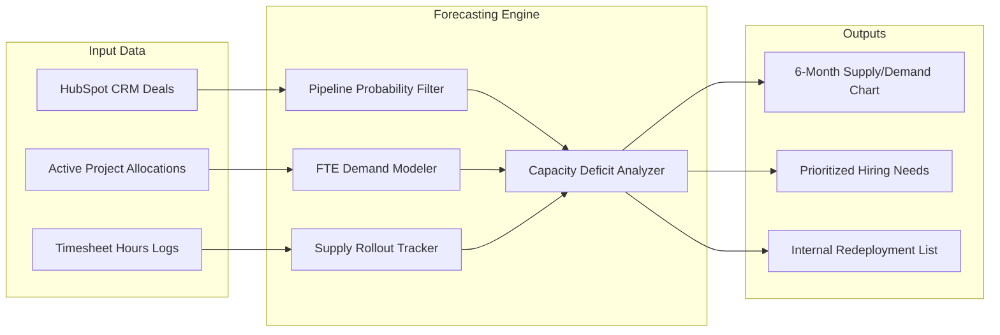
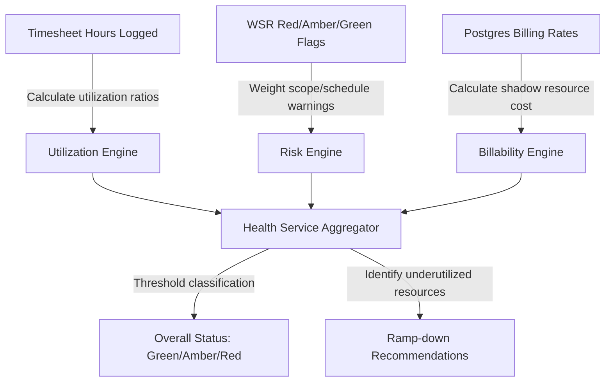
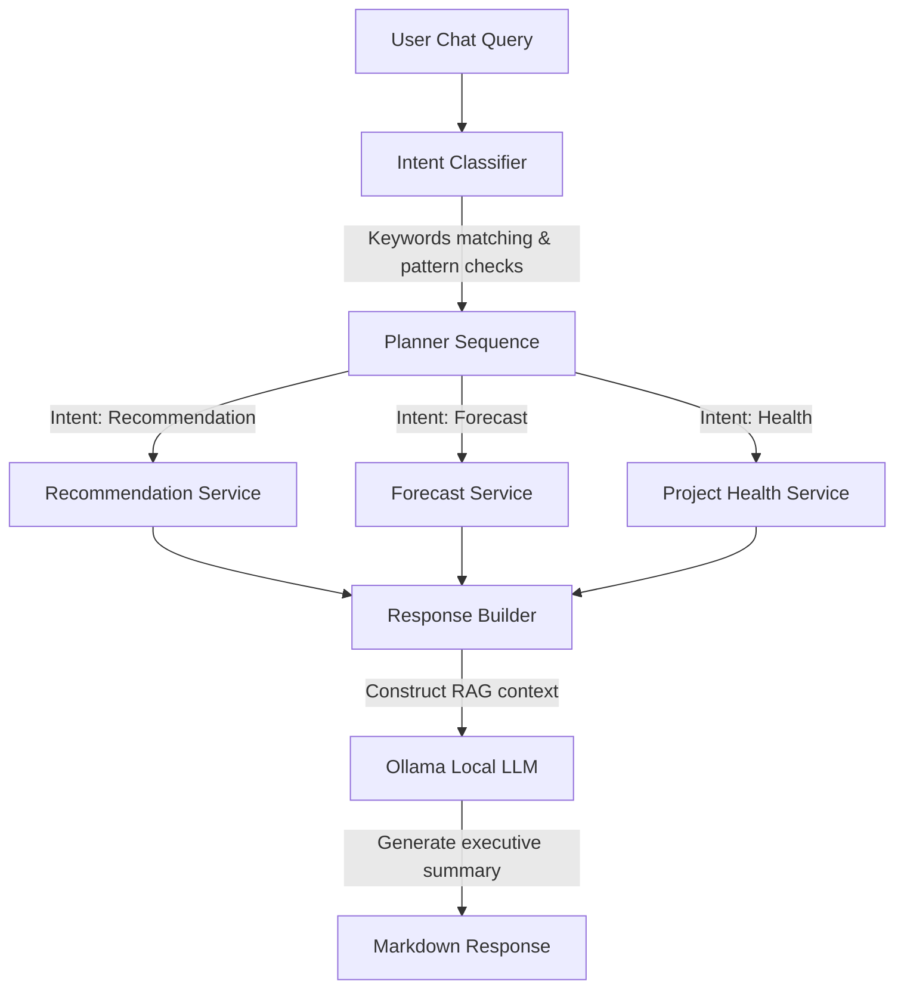

# System Design & Data Pipelines

This document describes the design patterns, mathematical formulas, and data pipeline structures powering the decision-intelligence engines of the platform.

---

## 1. Recommendation Engine Pipeline

The recommendation engine matches resources to projects by evaluating skill compatibility, semantic similarity, qualitative competencies, availability, and historical contract metrics.

### Hybrid Score Calculation

$$Score_{\text{final}} = w_1 \cdot Score_{\text{skills}} + w_2 \cdot Score_{\text{semantic}} + w_3 \cdot Score_{\text{availability}} + w_4 \cdot Score_{\text{competency}} + w_5 \cdot Score_{\text{history}}$$

Where:
- $Score_{\text{skills}}$ is calculated using skill frequency weighted by their rarity (IDF).
- $Score_{\text{semantic}}$ is the cosine similarity score returned by Qdrant.
- $Score_{\text{availability}}$ measures the developer's allocation buffer (bench time).
- $Score_{\text{competency}}$ is the average score across required qualitative capabilities.
- $Score_{\text{history}}$ evaluates the developer's experience with the required project type.

---

## 2. Capacity & Demand Forecast Pipeline

The forecast engine analyzes time-tracking datasets and pipeline contracts to predict upcoming staffing shortages and identify hiring requirements.

- **Operational Capacity**: Modeled by tracking active employees' availability timelines, accounting for upcoming contract completions.
- **Projected Demand**: Calculated by aggregating FTE requirements from active projects and adding HubSpot pipeline opportunities, weighted by their closing probability.

---

## 3. Project Health Diagnostic Pipeline

The project health engine assesses delivery risk using hours tracked on timesheets and indicators from Weekly Status Reports (WSR).

### Risk Heuristics Status Capping

- **WSR Status Warnings**: Adds $+20.0$ points for Red statuses and $+10.0$ points for Amber statuses across scope, schedule, quality, and CSAT indicators.
- **Timeline Slippage**: Adds $+15.0$ points if a project is past its scheduled end date without being marked completed.
- **Risk Level**: Capped at $100.0$. Scores $\ge 75.0$ are classified as **Red (Critical)**, $50.0 - 75.0$ as **Red (High Risk)**, $25.0 - 50.0$ as **Amber (Medium Risk)**, and $< 25.0$ as **Green (Healthy)**.

---

## 4. Copilot Conversational Pipeline

The Copilot acts as an intelligent assistant, routing natural language questions to decision sub-engines.

- **Session Memory**: Uses regex patterns to identify Project IDs (`CLI-X`) or Employee IDs (`EMP-Y`) from queries and retains them across follow-up conversational questions.
- **Relational Fallback**: If vector search is unavailable, the database adapter executes SQL queries to locate resources.
